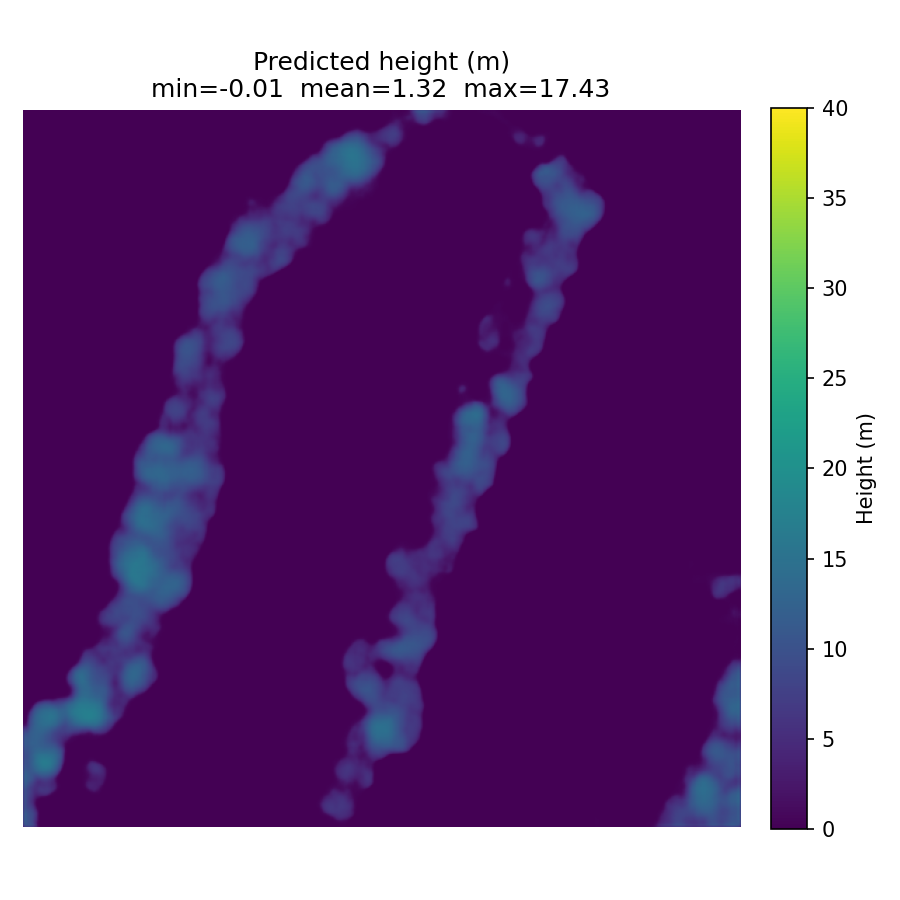
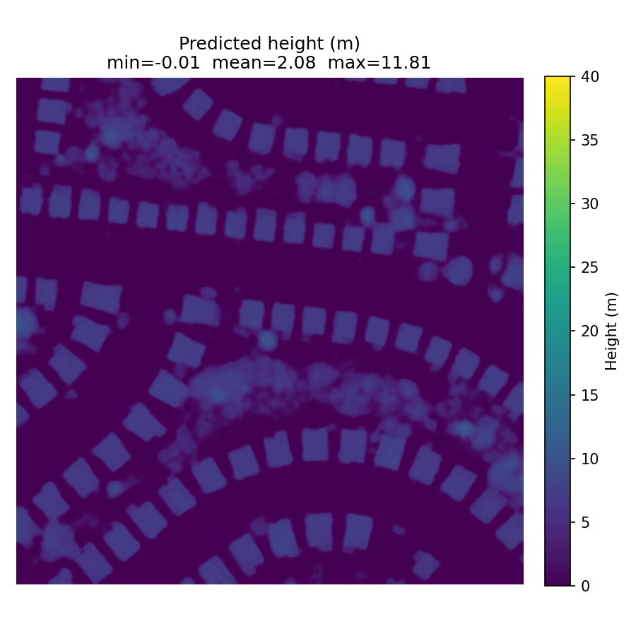
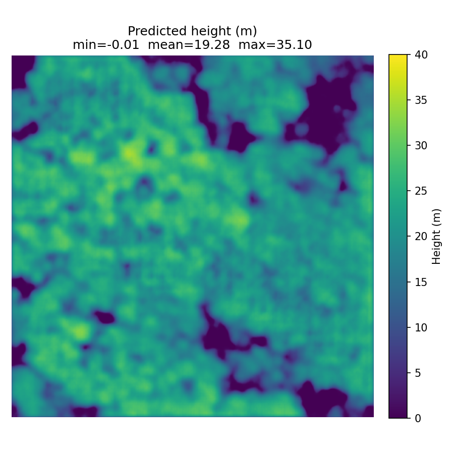

# ResHeightNet

A PyTorch reimplementation of *"Height Estimation from Single Aerial
Images Using a Deep Convolutional Encoder-Decoder Network"*
(Amirkolaee & Arefi, 2019, ISPRS Journal of Photogrammetry and Remote
Sensing), built as an independent baseline using transfer learning.

No official code was released for this paper — this is an open,
from-scratch implementation.

## What it does

Given a single RGB aerial tile, predicts a per-pixel height map (nDSM,
in metres).

## Architecture

ResNet34 encoder (ImageNet-pretrained, fully fine-tuned) + a
skip-connected upsampling decoder — see `src/model.py` for the full
architecture and inline rationale.

## Data

[GAMUS](https://huggingface.co/datasets/earthflow/GAMUS) (CC-BY-4.0),
via the deterministic `stage_a1` splits reused verbatim from the
DepthWizard project (`data/splits/`) so results are directly comparable
to DepthWizard's own reported baseline. 1000 training tiles (500
Philadelphia + 500 Washington DC), 200 validation tiles (100 + 100).
GAMUS ships HDF5 RGB/AGL-height/semantic-class triplets, 1024x1024,
0.5 m/px. See `docs/limitations.md` for known caveats in this split.

## Results

| Model | MAE (m) | RMSE (m) | Pearson r |
|---|---|---|---|
| **ResHeightNet (ours)** | **2.17** | **4.33** | **0.844** |
| DepthWizard M1 *(reported)* | 3.31 | 6.28 | 0.68 |

Same protocol for both (512x512 center crop, pooled per-pixel across
all 200 `stage_a1_val` tiles, predictions not clamped). ResHeightNet
beats the reported DepthWizard M1 baseline on all three metrics here —
notable since DepthWizard's M1 also has a frozen Depth Anything V2
depth prior as an extra input, which this model doesn't have access to.
See `docs/comparison_table.md` for the full table (including a
constant-predictor calibration row, per-class/per-height-bucket error
breakdown, and full source citations) and `docs/limitations.md` for
what this comparison does and does not control for.

Sample predictions:





## Setup

```powershell
python -m venv .venv
.venv\Scripts\python.exe -m pip install --index-url https://download.pytorch.org/whl/cpu torch==2.6.0 torchvision==0.21.0
.venv\Scripts\python.exe -m pip install -r requirements-dev.txt
```

On Colab, skip pinning torch/torchvision (use the preinstalled CUDA
build) and just `pip install -r requirements.txt` for the rest.

## Usage

```powershell
# Fetch a small local sanity subset (20 tiles, ~230 MB) for CPU-only
# development/testing:
.venv\Scripts\python.exe scripts\fetch_gamus.py --split data\splits\stage_a1_val.txt --limit 20

# Overfit gate -- fast, falsifiable wiring check before spending any
# Colab GPU time:
.venv\Scripts\python.exe -m src.train --overfit 10 --steps 300

# Full training (intended for Colab's free T4 GPU -- see
# notebooks/colab_train.ipynb; runs on CPU too, just far slower):
.venv\Scripts\python.exe -m src.train

# Evaluate at DepthWizard-parity protocol:
.venv\Scripts\python.exe -m src.evaluate --checkpoint results\checkpoints\best.pt

# Run inference on one GAMUS tile:
.venv\Scripts\python.exe -m src.infer --sample DC_38_52 --checkpoint results\checkpoints\best.pt
```

## Tests

```powershell
.venv\Scripts\python.exe -m pytest tests -q --cov=src --cov-report=term-missing
```

92%+ coverage, all synthetic data — no real GAMUS download required to
run the suite. See `tests/` for unit tests (masking, crop alignment,
loss correctness, metric parity against a vendored copy of
DepthWizard's own metric implementation) and integration tests
(end-to-end training step, bitwise-verified checkpoint resume).

## Honest scope note

This reimplementation uses a pretrained ResNet34 encoder and the GAMUS
dataset rather than training a custom encoder from scratch on ISPRS
Vaihingen/Potsdam as the original paper did. Architecture and training
objective follow the paper closely; exact published numbers are not
expected to be reproduced. The DepthWizard comparison baseline is
itself a *reported*, not independently re-runnable, number — see
`docs/comparison_table.md` and `docs/limitations.md` for full
disclosure of every deviation and caveat.

## Citation

Amirkolaee, H. A., & Arefi, H. (2019). Height estimation from single
aerial images using a deep convolutional encoder-decoder network.
*ISPRS Journal of Photogrammetry and Remote Sensing*, 149, 50-66.

GAMUS dataset: [earthflow/GAMUS](https://huggingface.co/datasets/earthflow/GAMUS)
(CC-BY-4.0). PyTorch dataloader reference:
[EarthNets/RSI-MMSegmentation](https://github.com/EarthNets/RSI-MMSegmentation).

## Implementation notes

The specific correctness traps this implementation guards against
(GAMUS's HDF5 format, its negative-height nodata encoding, memory-safe
metric computation, etc.) are documented inline in the source
(`src/dataset.py`, `src/losses.py`, `src/metrics.py`, `src/train.py`
docstrings) and in `docs/limitations.md`.
